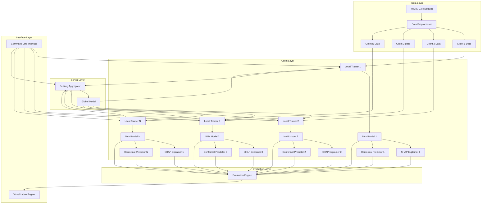

# Design Document

## Overview

FedNAMs+ is a federated learning framework that combines Neural Additive Models (NAMs) with SHAP-based explainability and conformal prediction for uncertainty quantification. The system is designed for medical imaging applications, specifically chest X-ray analysis using the MIMIC-CXR dataset, while maintaining privacy through federated learning principles.

The architecture follows a client-server federated learning paradigm where multiple simulated hospital clients train local NAM models on their private data partitions, and a central server aggregates model parameters without accessing raw data. Each client generates local SHAP explanations and uncertainty estimates, enabling transparent and trustworthy AI for clinical decision support.

## Architecture

### High-Level System Architecture



### Component Architecture

The system is organized into five primary modules:

1. **Data Module** (`data/`): Handles dataset downloading, preprocessing, and federated partitioning
2. **Models Module** (`models/`): Implements NAM architecture, baseline models, and model utilities
3. **Training Module** (`training/`): Manages local training, federated aggregation, and training orchestration
4. **Explainability Module** (`explainability/`): Computes SHAP values, generates visualizations, and analyzes explanation quality
5. **Experiments Module** (`experiments/`): Coordinates end-to-end experiments, evaluation, and result generation

## Components and Interfaces

### 1. Data Module

#### DataDownloader
**Purpose**: Downloads and validates the MIMIC-CXR dataset from Kaggle or PhysioNet

**Interface**:
```python
class DataDownloader:
    def download(self, source: str, output_dir: str) -> Path
    def verify_integrity(self, data_dir: Path) -> bool
```

**Key Design Decisions**:
- Supports both Kaggle API and manual download paths
- Implements checksum verification for data integrity
- Handles authentication and rate limiting

#### DataPreprocessor
**Purpose**: Preprocesses chest X-ray images and labels for model training

**Interface**:
```python
class DataPreprocessor:
    def __init__(self, config: PreprocessConfig)
    def preprocess_images(self, image_paths: List[Path]) -> np.ndarray
    def preprocess_labels(self, labels_df: pd.DataFrame) -> np.ndarray
    def create_train_val_test_split(self, data: Dataset) -> Tuple[Dataset, Dataset, Dataset]
```

**Key Design Decisions**:
- Configurable image resizing (default: 224x224 for CNN compatibility)
- Normalization using ImageNet statistics for transfer learning
- Supports multi-label classification for multiple pathologies
- Implements stratified splitting to maintain label distributions

#### FederatedDataPartitioner
**Purpose**: Partitions preprocessed data into non-IID client subsets

**Interface**:
```python
class FederatedDataPartitioner:
    def __init__(self, num_clients: int, strategy: str)
    def partition(self, dataset: Dataset) -> Dict[int, Dataset]
    def generate_statistics(self, partitions: Dict[int, Dataset]) -> pd.DataFrame
```

**Key Design Decisions**:
- Supports multiple partitioning strategies:
  - **Dirichlet**: Uses Dirichlet distribution for label imbalance (alpha parameter controls heterogeneity)
  - **Pathology-based**: Assigns clients different pathology distributions
  - **Quantity-based**: Varies dataset sizes across clients
- Generates metadata including label distributions, sample counts, and heterogeneity metrics
- Ensures each client has minimum viable training data

### 2. Models Module

#### FeatureExtractor
**Purpose**: Extracts feature representations from chest X-ray images using CNN

**Interface**:
```python
class FeatureExtractor(nn.Module):
    def __init__(self, backbone: str, pretrained: bool, feature_dim: int)
    def forward(self, x: torch.Tensor) -> torch.Tensor
    def freeze_backbone(self)
    def unfreeze_backbone(self)
```

**Key Design Decisions**:
- Supports multiple CNN backbones (ResNet18, ResNet50, DenseNet121)
- Uses pretrained ImageNet weights for transfer learning
- Outputs fixed-dimensional feature vectors (default: 512-d)
- Allows backbone freezing for faster initial training

#### NAMHead
**Purpose**: Implements the Neural Additive Model head for interpretable predictions

**Interface**:
```python
class NAMHead(nn.Module):
    def __init__(self, feature_dim: int, num_classes: int, hidden_units: List[int])
    def forward(self, features: torch.Tensor) -> Tuple[torch.Tensor, List[torch.Tensor]]
    def get_feature_contributions(self, features: torch.Tensor) -> List[torch.Tensor]
```

**Key Design Decisions**:
- Creates separate sub-networks for each feature dimension
- Each sub-network is a small MLP (e.g., [64, 32] hidden units)
- Outputs both final predictions and individual feature contributions
- Uses ExU (Exponential Units) activation for monotonicity constraints (optional)
- Applies feature dropout for regularization

#### FedNAMsModel
**Purpose**: Complete end-to-end model combining feature extraction and NAM head

**Interface**:
```python
class FedNAMsModel(nn.Module):
    def __init__(self, config: ModelConfig)
    def forward(self, x: torch.Tensor) -> torch.Tensor
    def forward_with_contributions(self, x: torch.Tensor) -> Tuple[torch.Tensor, List[torch.Tensor]]
    def get_parameters(self) -> Dict[str, torch.Tensor]
    def set_parameters(self, params: Dict[str, torch.Tensor])
```

**Key Design Decisions**:
- Modular design allows swapping feature extractors and NAM heads
- Supports both standard forward pass and contribution-aware forward pass
- Implements parameter serialization for federated communication
- Compatible with PyTorch's standard training loops

#### BaselineModels
**Purpose**: Implements baseline models for comparison

**Models**:
- **FedAvgCNN**: Standard CNN with FedAvg (ResNet or DenseNet)
- **FedAvgCNN_GradCAM**: CNN with Grad-CAM explanations
- **CentralizedNAM**: NAM trained on centralized data (privacy baseline)

**Interface**:
```python
class BaselineModel(nn.Module):
    def __init__(self, config: ModelConfig)
    def forward(self, x: torch.Tensor) -> torch.Tensor
    def get_explanations(self, x: torch.Tensor) -> np.ndarray
```

### 3. Training Module

#### LocalTrainer
**Purpose**: Manages local training on each client

**Interface**:
```python
class LocalTrainer:
    def __init__(self, model: nn.Module, config: TrainingConfig)
    def train_epoch(self, dataloader: DataLoader) -> Dict[str, float]
    def evaluate(self, dataloader: DataLoader) -> Dict[str, float]
    def get_model_parameters(self) -> Dict[str, torch.Tensor]
    def set_model_parameters(self, params: Dict[str, torch.Tensor])
```

**Key Design Decisions**:
- Supports multiple optimizers (Adam, SGD, AdamW)
- Implements learning rate scheduling (StepLR, CosineAnnealing)
- Uses mixed precision training for efficiency (optional)
- Tracks per-epoch metrics (loss, accuracy, AUC)
- Implements early stopping based on validation performance

#### FedAvgAggregator
**Purpose**: Aggregates client model parameters using Federated Averaging

**Interface**:
```python
class FedAvgAggregator:
    def __init__(self, aggregation_weights: Optional[List[float]])
    def aggregate(self, client_params: List[Dict[str, torch.Tensor]]) -> Dict[str, torch.Tensor]
    def weighted_average(self, tensors: List[torch.Tensor], weights: List[float]) -> torch.Tensor
```

**Key Design Decisions**:
- Supports both uniform and weighted aggregation (by dataset size)
- Handles parameter shape mismatches gracefully
- Implements secure aggregation placeholder for future privacy enhancements
- Efficient tensor operations using PyTorch

#### FederatedOrchestrator
**Purpose**: Coordinates the complete federated training process

**Interface**:
```python
class FederatedOrchestrator:
    def __init__(self, clients: List[LocalTrainer], aggregator: FedAvgAggregator, config: FedConfig)
    def run_round(self, round_num: int) -> Dict[str, Any]
    def run_training(self, num_rounds: int) -> Dict[str, Any]
    def save_checkpoint(self, round_num: int, path: Path)
    def load_checkpoint(self, path: Path) -> int
```

**Key Design Decisions**:
- Implements client sampling for scalability (random or importance-based)
- Tracks global and per-client metrics across rounds
- Supports checkpointing for fault tolerance
- Logs communication costs (parameters transmitted per round)
- Implements convergence detection for early termination

### 4. Explainability Module

#### SHAPExplainer
**Purpose**: Computes SHAP values for model predictions

**Interface**:
```python
class SHAPExplainer:
    def __init__(self, model: nn.Module, background_data: torch.Tensor)
    def explain(self, data: torch.Tensor, num_samples: int) -> np.ndarray
    def explain_batch(self, dataloader: DataLoader) -> Tuple[np.ndarray, np.ndarray]
```

**Key Design Decisions**:
- Uses DeepSHAP for neural network explanations
- Selects representative background samples using k-means clustering
- Supports batch processing for memory efficiency
- Computes SHAP values at the feature level (post-CNN extraction)
- Returns both SHAP values and base values for complete explanations

#### SHAPVisualizer
**Purpose**: Generates visualizations for SHAP explanations

**Interface**:
```python
class SHAPVisualizer:
    def plot_summary(self, shap_values: np.ndarray, feature_names: List[str], save_path: Path)
    def plot_feature_importance(self, shap_values: np.ndarray, save_path: Path)
    def plot_dependence(self, shap_values: np.ndarray, feature_idx: int, save_path: Path)
    def plot_client_comparison(self, client_shap_values: Dict[int, np.ndarray], save_path: Path)
```

**Key Design Decisions**:
- Generates publication-ready plots using matplotlib and seaborn
- Supports multiple visualization types (summary, bar, beeswarm, dependence)
- Creates client-specific and global comparison plots
- Exports plots in high-resolution PNG and PDF formats

#### ExplanationAnalyzer
**Purpose**: Analyzes explanation quality and consistency

**Interface**:
```python
class ExplanationAnalyzer:
    def compute_consistency(self, shap_values_list: List[np.ndarray]) -> float
    def compute_stability(self, shap_values: np.ndarray, perturbations: int) -> float
    def compute_feature_agreement(self, client_shap_values: Dict[int, np.ndarray]) -> np.ndarray
    def generate_report(self, analysis_results: Dict[str, Any], save_path: Path)
```

**Key Design Decisions**:
- **Consistency**: Measures agreement between repeated SHAP computations
- **Stability**: Tests robustness to input perturbations
- **Feature Agreement**: Computes correlation of feature importances across clients
- Generates comprehensive analysis reports with statistical tests

### 5. Conformal Prediction Module

#### ConformalPredictor
**Purpose**: Provides uncertainty quantification using conformal prediction

**Interface**:
```python
class ConformalPredictor:
    def __init__(self, model: nn.Module, alpha: float)
    def calibrate(self, cal_dataloader: DataLoader)
    def predict_with_sets(self, x: torch.Tensor) -> Tuple[torch.Tensor, List[Set[int]]]
    def compute_coverage(self, dataloader: DataLoader) -> float
```

**Key Design Decisions**:
- Implements Adaptive Prediction Sets (APS) method for multi-class classification
- Calibrates using held-out calibration set (15% of training data)
- Supports both client-specific and global calibration
- Computes empirical coverage and average set size metrics
- Handles class imbalance through score normalization

### 6. Experiments Module

#### ExperimentRunner
**Purpose**: Orchestrates complete experimental workflows

**Interface**:
```python
class ExperimentRunner:
    def __init__(self, config: ExperimentConfig)
    def setup_experiment(self)
    def run_experiment(self) -> Dict[str, Any]
    def evaluate_model(self, model: nn.Module, test_data: DataLoader) -> Dict[str, float]
    def save_results(self, results: Dict[str, Any], output_dir: Path)
```

**Key Design Decisions**:
- Supports multiple experiment types (FedNAMs+, baselines, ablations)
- Sets random seeds for reproducibility (Python, NumPy, PyTorch, CUDA)
- Implements comprehensive logging (TensorBoard, CSV, JSON)
- Generates all required plots and tables automatically
- Supports experiment resumption from checkpoints

#### EvaluationMetrics
**Purpose**: Computes all evaluation metrics

**Interface**:
```python
class EvaluationMetrics:
    @staticmethod
    def compute_classification_metrics(y_true: np.ndarray, y_pred: np.ndarray, y_prob: np.ndarray) -> Dict[str, float]
    @staticmethod
    def compute_explanation_metrics(shap_values: np.ndarray) -> Dict[str, float]
    @staticmethod
    def compute_uncertainty_metrics(predictions: List[Set[int]], y_true: np.ndarray, alpha: float) -> Dict[str, float]
    @staticmethod
    def compute_communication_cost(model: nn.Module, num_rounds: int) -> Dict[str, float]
```

**Metrics Computed**:
- **Classification**: Accuracy, Precision, Recall, F1-score, AUC-ROC, AUC-PR
- **Explanation**: SHAP consistency, feature stability, top-k agreement
- **Uncertainty**: Coverage, average set size, conditional coverage
- **Communication**: Total parameters transmitted, MB per round, compression ratio

## Data Models

### Configuration Objects

#### PreprocessConfig
```python
@dataclass
class PreprocessConfig:
    image_size: Tuple[int, int] = (224, 224)
    normalization: str = "imagenet"  # or "custom"
    augmentation: bool = True
    augmentation_params: Dict[str, Any] = field(default_factory=dict)
```

#### ModelConfig
```python
@dataclass
class ModelConfig:
    backbone: str = "resnet18"
    pretrained: bool = True
    feature_dim: int = 512
    num_classes: int = 14  # MIMIC-CXR pathologies
    nam_hidden_units: List[int] = field(default_factory=lambda: [64, 32])
    dropout: float = 0.3
    use_exu: bool = False
```

#### TrainingConfig
```python
@dataclass
class TrainingConfig:
    batch_size: int = 32
    learning_rate: float = 0.001
    num_local_epochs: int = 5
    optimizer: str = "adam"
    scheduler: Optional[str] = "cosine"
    early_stopping_patience: int = 10
    mixed_precision: bool = True
```

#### FedConfig
```python
@dataclass
class FedConfig:
    num_clients: int = 5
    num_rounds: int = 100
    client_fraction: float = 1.0  # Fraction of clients per round
    aggregation_weights: Optional[List[float]] = None
    min_clients: int = 3
```

#### ExperimentConfig
```python
@dataclass
class ExperimentConfig:
    experiment_name: str
    data_config: PreprocessConfig
    model_config: ModelConfig
    training_config: TrainingConfig
    fed_config: FedConfig
    output_dir: Path
    seed: int = 42
    device: str = "cuda"
```

### Data Structures

#### ClientData
```python
@dataclass
class ClientData:
    client_id: int
    train_dataset: Dataset
    val_dataset: Dataset
    test_dataset: Dataset
    calibration_dataset: Dataset
    metadata: Dict[str, Any]
```

#### TrainingResults
```python
@dataclass
class TrainingResults:
    round_metrics: List[Dict[str, float]]
    final_model_params: Dict[str, torch.Tensor]
    client_metrics: Dict[int, List[Dict[str, float]]]
    communication_cost: Dict[str, float]
    training_time: float
```

#### ExplanationResults
```python
@dataclass
class ExplanationResults:
    client_shap_values: Dict[int, np.ndarray]
    global_shap_values: np.ndarray
    feature_importances: np.ndarray
    consistency_score: float
    stability_score: float
    visualizations: Dict[str, Path]
```

#### UncertaintyResults
```python
@dataclass
class UncertaintyResults:
    prediction_sets: List[Set[int]]
    coverage: float
    average_set_size: float
    calibration_scores: np.ndarray
    client_coverage: Dict[int, float]
```

## Error Handling

### Error Hierarchy

```python
class FedNAMsError(Exception):
    """Base exception for FedNAMs+ system"""
    pass

class DataError(FedNAMsError):
    """Errors related to data loading and preprocessing"""
    pass

class ModelError(FedNAMsError):
    """Errors related to model architecture and operations"""
    pass

class TrainingError(FedNAMsError):
    """Errors during training and aggregation"""
    pass

class ExplanationError(FedNAMsError):
    """Errors during SHAP computation or visualization"""
    pass

class ConfigurationError(FedNAMsError):
    """Errors in configuration or setup"""
    pass
```

### Error Handling Strategies

1. **Data Loading Errors**:
   - Validate file existence and format before processing
   - Provide clear error messages for missing or corrupted files
   - Implement retry logic for network downloads
   - Log failed samples and continue processing valid data

2. **Training Errors**:
   - Catch NaN/Inf losses and terminate gracefully
   - Implement gradient clipping to prevent exploding gradients
   - Save checkpoints before each round for recovery
   - Log detailed error context (round number, client ID, batch)

3. **Memory Errors**:
   - Implement batch size reduction on OOM errors
   - Clear CUDA cache between rounds
   - Use gradient accumulation for large models
   - Provide memory usage monitoring and warnings

4. **Aggregation Errors**:
   - Validate parameter shapes before aggregation
   - Handle missing client updates gracefully
   - Implement timeout mechanisms for slow clients
   - Log aggregation failures with client details

5. **Explanation Errors**:
   - Catch SHAP computation failures and skip problematic samples
   - Validate background data selection
   - Implement fallback to simpler explanation methods
   - Log explanation quality warnings

## Testing Strategy

### Unit Tests

**Data Module Tests** (`tests/test_data.py`):
- Test data downloading and integrity verification
- Test image preprocessing with various configurations
- Test federated partitioning strategies
- Test metadata generation accuracy
- Test edge cases (empty datasets, single sample, extreme imbalance)

**Models Module Tests** (`tests/test_models.py`):
- Test feature extractor output shapes
- Test NAM head forward pass and contributions
- Test parameter serialization/deserialization
- Test model compatibility with different backbones
- Test baseline model implementations

**Training Module Tests** (`tests/test_training.py`):
- Test local trainer epoch execution
- Test FedAvg aggregation correctness
- Test weighted aggregation
- Test checkpoint saving and loading
- Test early stopping logic

**Explainability Module Tests** (`tests/test_explainability.py`):
- Test SHAP value computation
- Test explanation consistency
- Test visualization generation
- Test feature importance ranking

**Conformal Prediction Tests** (`tests/test_conformal.py`):
- Test calibration procedure
- Test prediction set generation
- Test coverage computation
- Test set size statistics

### Integration Tests

**End-to-End Training Test** (`tests/integration/test_e2e_training.py`):
- Test complete federated training workflow with minimal data
- Verify model convergence
- Verify checkpoint creation
- Verify metric logging

**Explanation Pipeline Test** (`tests/integration/test_explanation_pipeline.py`):
- Test SHAP computation after training
- Verify visualization generation
- Test explanation aggregation across clients

**Experiment Runner Test** (`tests/integration/test_experiment_runner.py`):
- Test complete experiment execution
- Verify all outputs are generated
- Test experiment resumption

### Test Data

- Create synthetic mini-dataset (100 images, 3 classes) for fast testing
- Use deterministic random seeds for reproducibility
- Mock external dependencies (Kaggle API, file downloads)
- Implement fixtures for common test scenarios

### Continuous Integration

- Run tests on every commit using GitHub Actions
- Test on multiple Python versions (3.8, 3.9, 3.10)
- Test on both CPU and GPU environments
- Generate coverage reports and enforce 70% minimum
- Run linting (flake8, black) and type checking (mypy)

## Performance Considerations

### Computational Efficiency

1. **Feature Extraction Caching**:
   - Cache extracted features to disk after first epoch
   - Reuse cached features for NAM head training
   - Reduces redundant CNN forward passes

2. **Mixed Precision Training**:
   - Use PyTorch AMP for faster training
   - Reduces memory footprint by ~50%
   - Minimal accuracy impact

3. **Batch Processing**:
   - Use DataLoader with multiple workers
   - Implement prefetching for GPU utilization
   - Optimize batch sizes for hardware

4. **SHAP Computation Optimization**:
   - Limit background samples (100-200 sufficient)
   - Use batch processing for SHAP values
   - Compute SHAP only on test set, not full dataset

### Memory Management

1. **Gradient Accumulation**:
   - Split large batches into micro-batches
   - Accumulate gradients before optimizer step
   - Enables larger effective batch sizes

2. **Model Checkpointing**:
   - Save only necessary state (model params, optimizer state)
   - Compress checkpoints using torch.save with compression
   - Implement checkpoint rotation (keep last N)

3. **Data Loading**:
   - Use memory-mapped arrays for large datasets
   - Implement lazy loading for images
   - Clear unused data from memory explicitly

### Scalability

1. **Client Sampling**:
   - Sample subset of clients per round (e.g., 50%)
   - Reduces communication and computation
   - Maintains convergence with proper sampling

2. **Asynchronous Aggregation** (Future Enhancement):
   - Allow clients to update at different rates
   - Implement staleness-aware aggregation
   - Improves wall-clock training time

3. **Distributed Training** (Future Enhancement):
   - Support multi-GPU training per client
   - Implement data parallelism for large models
   - Use distributed data loaders

## Privacy and Security

### Privacy Guarantees

1. **Data Isolation**:
   - Raw data never leaves client boundaries
   - Only model parameters transmitted
   - Server has no access to training data

2. **Differential Privacy** (Optional):
   - Add Gaussian noise to gradients before transmission
   - Implement privacy budget tracking (epsilon, delta)
   - Use Opacus library for DP-SGD implementation
   - Trade-off: Privacy vs. model accuracy

3. **Secure Aggregation** (Future Enhancement):
   - Encrypt client updates during transmission
   - Server aggregates without seeing individual updates
   - Requires cryptographic protocols (e.g., secure multi-party computation)

### Explanation Privacy

1. **SHAP Value Analysis**:
   - SHAP values computed locally on client data
   - Only aggregated statistics shared (mean, variance)
   - Individual SHAP values not transmitted

2. **Privacy Risks**:
   - Feature importances may reveal data distribution
   - Mitigation: Add noise to aggregated SHAP statistics
   - Document potential risks in privacy report

### Audit Logging

1. **Event Logging**:
   - Log all data access events with timestamps
   - Log model parameter transmissions
   - Log aggregation operations
   - Store logs in tamper-evident format

2. **Compliance Documentation**:
   - Generate privacy impact assessment
   - Document data flow diagrams
   - Provide GDPR/HIPAA compliance checklist

## Deployment and Usage

### Installation

```bash
# Clone repository
git clone https://github.com/username/fednams-plus.git
cd fednams-plus

# Create virtual environment
python -m venv venv
source venv/bin/activate  # On Windows: venv\Scripts\activate

# Install dependencies
pip install -r requirements.txt

# Download MIMIC-CXR dataset (requires Kaggle API)
python scripts/download_data.py --source kaggle --output data/mimic-cxr
```

### Configuration

Create experiment configuration file (`configs/experiment.yaml`):

```yaml
experiment_name: "fednams_plus_baseline"
seed: 42
device: "cuda"

data:
  dataset: "mimic-cxr"
  data_dir: "data/mimic-cxr"
  image_size: [224, 224]
  num_clients: 5
  partition_strategy: "dirichlet"
  alpha: 0.5

model:
  backbone: "resnet18"
  pretrained: true
  feature_dim: 512
  num_classes: 14
  nam_hidden_units: [64, 32]
  dropout: 0.3

training:
  num_rounds: 100
  num_local_epochs: 5
  batch_size: 32
  learning_rate: 0.001
  optimizer: "adam"

explainability:
  compute_shap: true
  shap_background_samples: 100
  shap_test_samples: 500

uncertainty:
  use_conformal: true
  confidence_level: 0.9
  calibration_fraction: 0.15
```

### Running Experiments

```bash
# Run FedNAMs+ experiment
python experiments/run_experiment.py --config configs/experiment.yaml

# Run baseline comparison
python experiments/run_baselines.py --config configs/baselines.yaml

# Run ablation studies
python experiments/run_ablations.py --config configs/ablations.yaml
```

### Google Colab Usage

```python
# In Colab notebook
!git clone https://github.com/username/fednams-plus.git
%cd fednams-plus
!pip install -r requirements.txt

# Mount Google Drive for data
from google.colab import drive
drive.mount('/content/drive')

# Run experiment
!python experiments/run_experiment.py --config configs/colab_experiment.yaml
```

### Output Structure

```
outputs/
├── experiment_name/
│   ├── config.yaml                 # Experiment configuration
│   ├── checkpoints/                # Model checkpoints
│   │   ├── round_010.pt
│   │   ├── round_020.pt
│   │   └── final.pt
│   ├── logs/                       # Training logs
│   │   ├── training.log
│   │   ├── metrics.csv
│   │   └── tensorboard/
│   ├── results/                    # Evaluation results
│   │   ├── classification_metrics.json
│   │   ├── explanation_metrics.json
│   │   ├── uncertainty_metrics.json
│   │   └── comparison_table.csv
│   └── visualizations/             # Plots and figures
│       ├── training_curves.png
│       ├── shap_summary_client_0.png
│       ├── shap_comparison.png
│       └── uncertainty_calibration.png
```

## Future Enhancements

1. **Advanced Privacy Mechanisms**:
   - Implement secure aggregation protocols
   - Add differential privacy with adaptive noise
   - Explore federated analytics for SHAP aggregation

2. **Model Improvements**:
   - Experiment with attention-based NAMs
   - Implement personalized federated learning
   - Add multi-modal support (images + clinical notes)

3. **Scalability Enhancements**:
   - Implement asynchronous federated learning
   - Add hierarchical aggregation for large-scale deployment
   - Support edge device deployment

4. **Explainability Extensions**:
   - Add counterfactual explanations
   - Implement concept-based explanations
   - Develop interactive explanation interfaces

5. **Clinical Integration**:
   - Build web-based dashboard for clinicians
   - Implement DICOM support for medical imaging
   - Add clinical decision support features
